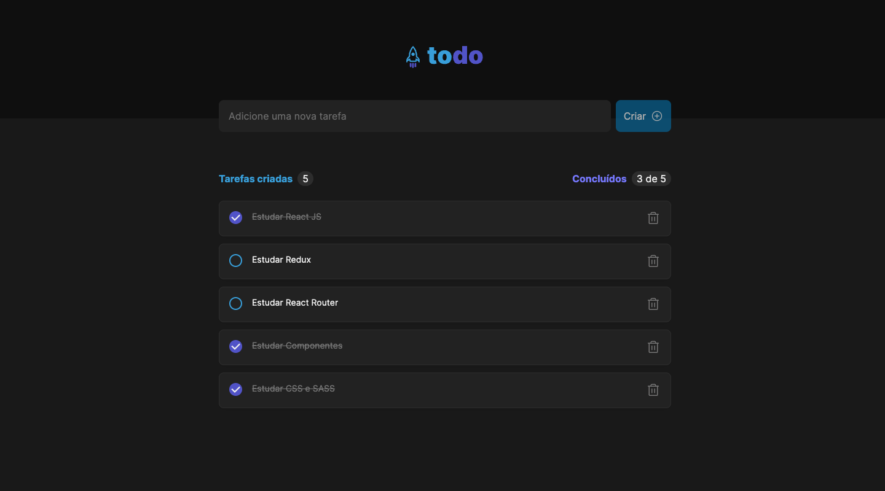
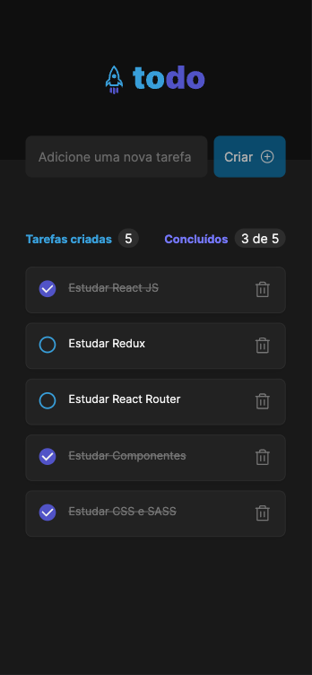

<h1 align="center">


</h1>

<p align="center">
  Todo - Tarefas a serem concluídas e histórico das tarefas já realizadas 📰🚀
  <br>
  <br>

  <a href="https://rocketseat.com.br">
    
  </a>

  <a href="www.linkedin.com/in/rhalfoliveira">
    
  </a>

  <a href="https://github.com/qwwerty/ig.news/commits/master">
    
  </a>

</p>

---

<p align="center">
  <a href="#dart-sobre">Sobre</a> &#xa0; | &#xa0; 
  <a href="#rocket-tecnologias">Tecnologias</a> &#xa0; | &#xa0;
  <a href="#white_check_mark-requerimentos">Requerimentos</a> &#xa0; | &#xa0;
  <a href="#checkered_flag-começando">Começando</a> &#xa0; &#xa0; | &#xa0;
  <a href="#framed_picture-imagens">Imagens</a> &#xa0; &#xa0;
</p>

<br>

## :dart: Sobre ##

O projeto to-do é responsável por gerenciar as tarefas a serem realizadas durante o dia-a-dia, podendo olhar o histórico das tarefas que já foram realizadas. A aplicação conta com um contador 
intuitivo que auxilia na visualização das informações de forma geral.


## :rocket: Tecnologias ##

As seguintes tecnologias foram utilizadas no projeto:

- [Vite Js](https://vitejs.dev/)
- [React Js](https://reactjs.org/)
- [uuid](https://www.npmjs.com/package/uuid)
- [Phosphor Icons](https://phosphoricons.com/)

## :white_check_mark: Requerimentos ##

- [Node](https://nodejs.org/en/)
- [Npm](https://www.npmjs.com/)
- [Yarn](https://yarnpkg.com/lang/en/)

## :checkered_flag: Começando ##

```bash
# Clone this project
$ git clone https://github.com/qwwerty/to-do

# Access
$ cd to-do

# Install dependencies
$ yarn install

# Run the project
$ yarn dev

# The server will initialize in the <http://localhost:3000>
```
## :framed_picture: Imagens ##

<p align="center">
    
</p>

<p align="center">
    
</p>


